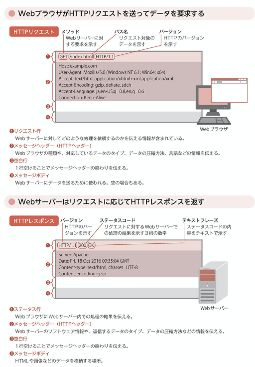

# -01 HTTPメッセージ
## output
    HTTP/2は最近誕生。データのやり取りを高速化。
    WebサーバがHTTP/2に対応していてもWebブラウザがHTTP/1.1だと2は使えない。

    HTTPメッセージ:
    WebブラウザとWebサーバでやりとりする際に使用されるデータ形式
    HTTPリクエストとHTTPレスポンスがある
    1つのHTTPリクエストに対して1つのHTTPレスポンスを返す

    HTTPメッセージの構成:
    ※各項目はCR+LF　の改行文字で区切られている

    ------------------
    開始行（1行のみ）
    ------------------
    メッセージヘッダー(HTTPヘッダー)（複数行可）
    ------------------
    空行（1行のみ）
    ------------------
    メッセージボディ（複数行可）
    ------------------

# -02 HTTPリクエスト/HTTPレスポンス
## output
    HTTPリクエストはリクエスト行、メッセージヘッダ、メッセージボディに分かれる。「情報を取得したい、情報を送信したい」という要求をサーバに伝える
    メッセージヘッダ: Webブラウザの情報、バージョン、対応するデータ形式の情報
    メッセージボディ: フォーム欄に入力したテキストデータなどが入る

    HTTPレスポンスはステータス行、メッセージヘッダ、メッセージボディに分かれる。HTTPリクエストに対してサーバ内の処理の結果を伝える
    メッセージヘッダ: Webサーバの種類、送信するデータ形式
    メッセージボディ: ブラウザからリクエストされたHTMLなどのデータ。
    ※HTMLのデータを受け取ったブラウザが内容を解析し、画像のリンクなどが会った場合は再度リクエスト<=>レスポンスを繰り返し、Webサイトとなる
    
   

# -03 HTTPメソッド
## output
    HTTPメソッド: Webサーバに要求する（リクエスト）際の処理の種類。
    HTMLファイルなどコンテンツ取得したい場合はGET、データを送信する場合はPOSTが利用される。保管しているコンテンツを書き換えたり削除するPUT、DELETEはWebサーバでは使用できない場合がほとんど

    GET: 
    URLの後ろに送りたいデータを付与して送る
    POST: 
    メッセージボディないにデータを含めて送る
    ので、POSTのほうがセキュア。IEではURLに使用できる文字列が2083文字と決まっているので、大量のデータを送信したいときにはPOSTが使われる
    HEAD:
    HTTPヘッダの情報のみを取得するHTTPメソッド。データの更新日時、サイズのみ取得したい場合に
    GET: 
    HTMLファイルや画像データを取得する際に利用。Webサイト閲覧時に頻度高い
    POST: 
    パスワードのデータ転送などの場合に利用
    PUT: 
    データをアップロードする際に利用。
    DELETE: 
    指定したデータを削除する場合に利用。
    CONNECT: 
    Webサーバに接続するまでに別のサーバを中継する場合に利用。悪用されることもあるので、利用を制限されてる場合も
    OPTIONS: 
    利用できるHTTPメソッドを問い合わせる場合に利用。利用制限されているメソッドの確認などに利用。
    TRACE: 
    ブラウザとサーバの経由チェックに利用。悪用されることもあるので利用制限
## next action
    ぱっと答えられるようにするべし

    HEAD
    GET
    POST
    PUT
    DELETE
    CONNECT
    OPTIONS
    TRACE

# -04 ステータスコード
## output
    ステータスコード: webサーバの処理結果

    100番台 Informational リクエスト継続中を通知
    200番台 Success
      200 リクエストが正常に受理された
    300番台 Redirection
      301(Moved Parmanently) リクエストされたコンテンツが移動した
      302(Found) リクエストされたコンテンツが一時的に移動した（別の場所で発見された）
      304(Not Modified) リクエストされたコンテンツが未更新。一時的に保存されたコンテンツが表示される？
    400番台 Client Error
      400(Bad Request) リクエストが不正である
      404(Not Found) リクエストされたコンテンツが未検出
    500番台 Server Error
      500(Internet Server Error) リクエスト処理中にサーバ内部でエラーが発生
      503(Srervice Unavailable) アクセス集中やメンテナンスなどの理由で一時的に処理が不可である

## why/what
    ・304 がよくわからない
    エラーではなく、ブラウザ内のキャッシュに残っているコンテンツを使って表示させるときなどにこれが返ってくる

# -05 メッセージヘッダー
## output
    HTTPリクエストとHTTPレスポンスで送受信される情報
    複数のヘッダーフィールドからなり、HTTPメッセージで　のやり取りにおける詳細な情報を示すために使われる。
    ヘッダーフィールドは独自に定義したものを利用することも可能

    - 一般ヘッダーフィールド
      HTTPリクエストとレスポンスの両方に含まれるヘッダーフィールド。HTTPメッセージ全体に対しての付加情報を示す。

      Connection: リクエスト後はTCPコネクション切断など接続状態に関する通知
      Date: HTTPメッセージが作成された日付
      Upgrade: HTTPのバージョンをアップデートするように要求

    - リクエストヘッダーフィールド
      HTTPリクエストのみに含まれるヘッダーフィールド。User-Agentがある。スマホかPCかを判別して処理を行う

      Host: リクエスト先のサーバ名
      Referer: 直前にリンクしていたWebページのURL
      User-Agent: Webブラウザの固有情報（プロダクト名、バージョンなど）

    - レスポンスヘッダーフィールド
      HTTPレスポンスのみに含まれるヘッダーフィールド。Webサーバ機能を提供するプロダクト情報を示すServerがある。攻撃対象となることもあるので、情報制限も可能

      Location: リダイレクト先のWebページ情報
      Server: Webサーバの固有情報（プロダクト名、バージョンなど）

    - エンティティヘッダーフィールド
      HTTPリクエストとレスポンス両方に含まれるヘッダーフィールド。メッセージボディに含まれるデータの付加情報を示す。Content-Typeなど

      Allow: 利用可能なHTTPメソッドの一覧
      Content-Encoding: コンテンツのエンコード（データ変換）方式
      Content-Language: コンテンツの使用言語
      Content-Length: コンテンツのサイズ、単位はバイト（byte）
      Content−Type: コンテンツの種類（テキスト、画像など）
      Expires: コンテンツの有効期限
      Last-Modified: コンテンツの最終更新時刻

## check
    Refererの綴りは誤って登録されて依頼そのままとかウケる！Referrer
    ヘッダーフィールドを独自に定義ってどういうことだろう？

# -06 TCPによるデータ通信
## output
    TCPはメール送受信、ファイル転送など様々なデータ転送時に利用されている。コネクションの確立と分断まで3回のやり取りを行う
    コネクションの確立により、クライアントとサーバがお互いに通信可能であると確認したうえで、データのやり取りが開始される

    SYN: クライアントからの接続要求。SYNパケットというデータをおくる
    SYN+ACK: クライアントに対して確認応答およびサーバからの接続要求。確認応答としてACKパケットというデータを送る。
    ACK: サーバに対して確認応答

    コネクションの確立だけでなく、データを転送する際に再送制御（一定期間ACKの応答がない場合、データを再送信する）および順序制御（順序が入れ替わって届いた場合、順序番号をみて元のデータを組み立てる）を行っている。複数のデータを受け取ってからACKパケットを送信する

# -07 HTTP/1.1のやりとり
## output
    1つのWebページに画像が多数埋め込まれる使い方が普及すると、以前までのHTTPリクエストごとにコネクションを確立していると効率が悪い。そのため、HTTP／1.1以降ではコネクションを継続して利用する方式になった。これをHTTPキープアライブという。

    HTTPキープアライブ: HTTPレスポンスを待つことなく、複数のHTTPリクエストを送れる。
    HTTPパイプライン: HTTP/1.1でサポートされている機能。HTTPレスポンスを待つことなく複数のHTTPリクエストを送信することを可能にする。

## why
    コネクションの切断をする判断は1つのWebページが読み込まれるまでを判断している、ということ？どこで切断という判断をしてるのか。

# -08 HTTP/2のやりとり
## output
    Googleが提案したSPDYと呼ばれる高速化通信のプロトコルがベースになってる。
    ストリームによる多重化: 前述のHTTPパイプライン機能でも一度にリクエストを送信することはできるが、リクエストの順序どおりにレスポンスを返さなければいけない制約がある。なので時間がかかるリクエストがあった場合はそれが完了するまで待たなければならない。
    HTTP/2では並行してリクエストとレスポンスをやりとりできるストリームと呼ばれる仮想的な通信経路を複数生成できる。ので先行のレスポンスを待たなくて良くなった！
## why
    めちゃいい。早くこれになってほしい。けど、すぐに移行できない制約はなんだろう？ブラウザ側にも問題あり？Google提案であればChromeとか使っていれば自動的にHTTP/2になってるのか？

# -09 HTTP／2での改良点
## output
    ---------------------
    バイナリ形式の利用
    ---------------------
    HTTPリクエストのデータが、フレーム単位に分割され、バイナリ形式で送信されている（1.1まではバイナリ形式 > テキスト形式へ変換してたがバイナリ形式のまま送れる）
    ※HEADERSフレーム、DATAフレームなど
    ---------------------
    ヘッダー圧縮
    ---------------------
    1回目のリクエストと2回目のリクエストでヘッダの差分のみ転送する圧縮方式（HPACK）を利用している
    ---------------------
    サーバープッシュ
    ---------------------
    WebブラウザからのHTTPリクエストの情報を元に、予め必要なリソース（img、cssなど）をWebサーバから転送する。え、最高やん

# -10 HTTPSの仕組み
## output
    HTTP over SSL/TLS の略
    SSL(Secure Sockets Layer)、TSL(Transport Security Layer)の暗号化方式を用いて通信を行う

    3つの仕組みで安全性確保
    1. 盗聴防止(暗号化通信)
    データを暗号化して送信

    2. 改ざん防止
    メッセージダイジェストにより改ざんを防ぐ
    送信するハッシュ値を計算してデータと一緒に送信
    サーバがデータを受けとって計算した結果が異なると改ざんがあったとわかる

    3. なりすまし防止
    SSLサーバ証明書を用意し、接続時に検証することにより、Webサイトを運営する会社の身元を確認する

# -11 HTTPSのやり取り
## output
    4つのフェーズを経て、HTTPSでの通信が開始される。
    SSL／TLSハンドシェイクと呼ばれている。
    暗号化方式の決定: 相互
    通信相手の証明: Webサーバ
    鍵の交換: Webブラウザ
    暗号化方式の確認: 相互

# -12 ステートフルとステートレス
## output
    Stateless: 状態を保持しない。リクエスト/レスポンスの1往復でやり取りが完結。
    Stateful: 状態を保持。次の処理内容に反映させる。多クライアント対1サーバのとき、サーバ負荷が高くなる。そのため、多クライアントがいる場合のWebシステムで利用されるHTTPでは、ステートレスな設計が適している。

    HTTPの弱点
    ECサイトで商品を保持する、かごの中身を見る、購入する、などはWebブラウザからの異なるリクエストで、ステートレスだと保持されない。
    そのためHTTPを補完する別の仕組みとして以前の状態を保持し管理する仕組みが導入されている。

# -13 Cookie
## output
    HTTPにおいて状態を保持し管理する必要がある場合に用いられる。
    Webサーバへ接続 > コンテンツと一緒にブラウザに保持してもらいたい情報をCookieとして送る（Webブラウザの識別情報など）。
    Cookieを受け取ったブラウザはテキストファイルとして保存しておき、次にWebサーバに接続するときに一緒にCookieを送信する。

    Cookieの送信:
    メッセージヘッダーが利用される。
    Webサーバ: HTTPレスポンスに「Set-Cookie」ヘッダーを含める
    Webブラウザ: HTTPリクエストに「Cookie」ヘッダーを含める

    > HTTPレスポンス:Set-Cookie
    HTTP/1.1 200 OK
    Set-Cookie:name=value,expires=date;domain=DOMAIN_NAME
    cookie名,有効期限,Webサーバ情報

    > HTTPリクエスト:Cookie
    HTTP/1.1 200 OK
    Cookie:name=value

    セッションCookie:
    有効期限が設定されていないCookieのこと。ブラウザが閉じると削除される。有効期限が設定されたCookieは削除されない。
    ECなどではセッションCookieが使用される。

## tips
    Set−Cookieヘッダーフィールドに記述する属性

 | 属性 | 必須 | 内容 |
 | ---- | ---- | ---- |
 | name=value | 必須 | Cookieにtける名前とその値 |
 | expires=date | 任意 | Cookieの有効期限 |
 | max-age=seconds | 任意 | Cookieの残存時間を秒数で指定 |
 | secure | 任意 | HTTPSで通信している場合にのみCookieを送信 |
 | hittponly | 任意 | JavaScriptからのCookieへの参照制限 |
 | domain=DOMAIN_NAME | 任意 | Cookieが利用されるドメイン名 |
 | path=PATH | 任意 | Cookieが利用されるサーバ上のパス |  
 

# -14 セッション
## output
    セッション: 一連の処理の流れ
    
    セッションIDを利用したセッション管理:
    セッションIDはWebサーバ上で生成・管理され、Cookieに含めてブラウザに送信される。次回以降、CookieにセッションIDを含めて処理を行うことで、セッションを維持できる

    セッションIDの渡し方:
    一般的にはCookieに含めて渡す。他には下記。
    リンクのURLに埋め込み、パラメータとしてセッションID を含めてやりとりする。
    またフォームデータに埋め込み、セッションID を含めてやりとりする場合もある。<input type="hidden" name="SID" value="XXXXXXXX">
    どちらも漏洩する場合があるので、あまり利用しない

# -15 URI
## output
    URI: Uniform Resource Identifier
    情報やデータといったリソースを識別するための記述方法。
    コンピュータが扱うリソースに限らず、人や会社、書籍などあらゆるリソースを示す。

    スキームと呼ばれす識別子で始まり、: で区切って定められた表現形式で記述される

| スキーム: | スキームごとの表現形式 |
| ---- | ---- |
| http: | //xxxx.com/xxx/hoge.html | 
| ftp: | //xxxx.com/xxxx/xxxx.doc |
| urn: | isbn:0-123-1234-0 isbnコード:0-123-1234-0で示される書籍 |
| urn: | ietf:rfc2648 ietfによって管理されているRFC2648の文書 |
 

    URL: Uniform Resource Locator
    URIのうち、リソースが存在する場所を示すもの

    URN: Uniform Resource Name
    リソースの名前を示す
 

    リクエストURI:
    絶対URI形式と相対URI形式がある。HTTPリクエストの場合、リクエスト業のメソッドに続いて記述される
    HTTPリクエストがプロキシサーバを経由する場合は絶対URI、通常は相対URI

    絶対URI:
    GET http://xxxx.com/xxx/hoge.html HTTP/1.1
    Host:xxxx.com

    相対URI:
    GET //xxxx.com/xxx/hoge.html HTTP/1.1
    Host:xxxx.com
 

    パーセントエンコーディング:
    予約文字、非予約文字以外の文字（日本語など）は%のあとに16進数で表した形で変換される。文字コードによって変換結果は異なる
 
