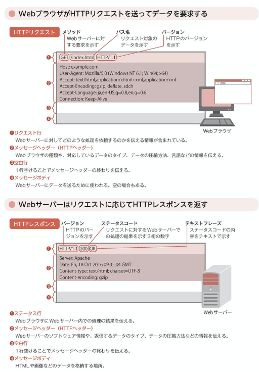

# -01 HTTPメッセージ
## output
    HTTP/2は最近誕生。データのやり取りを高速化。
    WebサーバがHTTP/2に対応していてもWebブラウザがHTTP/1.1だと2は使えない。

    HTTPメッセージ:
    WebブラウザとWebサーバでやりとりする際に使用されるデータ形式
    HTTPリクエストとHTTPレスポンスがある
    1つのHTTPリクエストに対して1つのHTTPレスポンスを返す

    HTTPメッセージの構成:
    ※各項目はCR+LF　の改行文字で区切られている

    ------------------
    開始行（1行のみ）
    ------------------
    メッセージヘッダー(HTTPヘッダー)（複数行可）
    ------------------
    空行（1行のみ）
    ------------------
    メッセージボディ（複数行可）
    ------------------

# -02 HTTPリクエスト/HTTPレスポンス
## output
    HTTPリクエストはリクエスト行、メッセージヘッダ、メッセージボディに分かれる。「情報を取得したい、情報を送信したい」という要求をサーバに伝える
    メッセージヘッダ: Webブラウザの情報、バージョン、対応するデータ形式の情報
    メッセージボディ: フォーム欄に入力したテキストデータなどが入る

    HTTPレスポンスはステータス行、メッセージヘッダ、メッセージボディに分かれる。HTTPリクエストに対してサーバ内の処理の結果を伝える
    メッセージヘッダ: Webサーバの種類、送信するデータ形式
    メッセージボディ: ブラウザからリクエストされたHTMLなどのデータ。
    ※HTMLのデータを受け取ったブラウザが内容を解析し、画像のリンクなどが会った場合は再度リクエスト<=>レスポンスを繰り返し、Webサイトとなる
    
   

# -03 HTTPメソッド
## output
    HTTPメソッド: Webサーバに要求する（リクエスト）際の処理の種類。
    HTMLファイルなどコンテンツ取得したい場合はGET、データを送信する場合はPOSTが利用される。保管しているコンテンツを書き換えたり削除するPUT、DELETEはWebサーバでは使用できない場合がほとんど

    GET: 
    URLの後ろに送りたいデータを付与して送る
    POST: 
    メッセージボディないにデータを含めて送る
    ので、POSTのほうがセキュア。IEではURLに使用できる文字列が2083文字と決まっているので、大量のデータを送信したいときにはPOSTが使われる
    HEAD:
    HTTPヘッダの情報のみを取得するHTTPメソッド。データの更新日時、サイズのみ取得したい場合に
    GET: 
    HTMLファイルや画像データを取得する際に利用。Webサイト閲覧時に頻度高い
    POST: 
    パスワードのデータ転送などの場合に利用
    PUT: 
    データをアップロードする際に利用。
    DELETE: 
    指定したデータを削除する場合に利用。
    CONNECT: 
    Webサーバに接続するまでに別のサーバを中継する場合に利用。悪用されることもあるので、利用を制限されてる場合も
    OPTIONS: 
    利用できるHTTPメソッドを問い合わせる場合に利用。利用制限されているメソッドの確認などに利用。
    TRACE: 
    ブラウザとサーバの経由チェックに利用。悪用されることもあるので利用制限
## next action
    ぱっと答えられるようにするべし

    HEAD
    GET
    POST
    PUT
    DELETE
    CONNECT
    OPTIONS
    TRACE

# -04 ステータスコード
## output
    ステータスコード: webサーバの処理結果

    100番台 Informational リクエスト継続中を通知
    200番台 Success
      200 リクエストが正常に受理された
    300番台 Redirection
      301(Moved Parmanently) リクエストされたコンテンツが移動した
      302(Found) リクエストされたコンテンツが一時的に移動した（別の場所で発見された）
      304(Not Modified) リクエストされたコンテンツが未更新。一時的に保存されたコンテンツが表示される？
    400番台 Client Error
      400(Bad Request) リクエストが不正である
      404(Not Found) リクエストされたコンテンツが未検出
    500番台 Server Error
      500(Internet Server Error) リクエスト処理中にサーバ内部でエラーが発生
      503(Srervice Unavailable) アクセス集中やメンテナンスなどの理由で一時的に処理が不可である

## why/what
    ・304 がよくわからない
    エラーではなく、ブラウザ内のキャッシュに残っているコンテンツを使って表示させるときなどにこれが返ってくる

# -05 メッセージヘッダー
## output
    HTTPリクエストとHTTPレスポンスで送受信される情報
    複数のヘッダーフィールドからなり、HTTPメッセージで　のやり取りにおける詳細な情報を示すために使われる。
    ヘッダーフィールドは独自に定義したものを利用することも可能

    - 一般ヘッダーフィールド
      HTTPリクエストとレスポンスの両方に含まれるヘッダーフィールド。HTTPメッセージ全体に対しての付加情報を示す。

      Connection: リクエスト後はTCPコネクション切断など接続状態に関する通知
      Date: HTTPメッセージが作成された日付
      Upgrade: HTTPのバージョンをアップデートするように要求

    - リクエストヘッダーフィールド
      HTTPリクエストのみに含まれるヘッダーフィールド。User-Agentがある。スマホかPCかを判別して処理を行う

      Host: リクエスト先のサーバ名
      Referer: 直前にリンクしていたWebページのURL
      User-Agent: Webブラウザの固有情報（プロダクト名、バージョンなど）

    - レスポンスヘッダーフィールド
      HTTPレスポンスのみに含まれるヘッダーフィールド。Webサーバ機能を提供するプロダクト情報を示すServerがある。攻撃対象となることもあるので、情報制限も可能

      Location: リダイレクト先のWebページ情報
      Server: Webサーバの固有情報（プロダクト名、バージョンなど）

    - エンティティヘッダーフィールド
      HTTPリクエストとレスポンス両方に含まれるヘッダーフィールド。メッセージボディに含まれるデータの付加情報を示す。Content-Typeなど

      Allow: 利用可能なHTTPメソッドの一覧
      Content-Encoding: コンテンツのエンコード（データ変換）方式
      Content-Language: コンテンツの使用言語
      Content-Length: コンテンツのサイズ、単位はバイト（byte）
      Content−Type: コンテンツの種類（テキスト、画像など）
      Expires: コンテンツの有効期限
      Last-Modified: コンテンツの最終更新時刻

## check
    Refererの綴りは誤って登録されて依頼そのままとかウケる！Referrer
    ヘッダーフィールドを独自に定義ってどういうことだろう？

# -06 TCPによるデータ通信
## output
## why
## check
## next action

# -0
## output
## why
## check
## next action

# -0
## output
## why
## check
## next action

# -0
## output
## why
## check
## next action